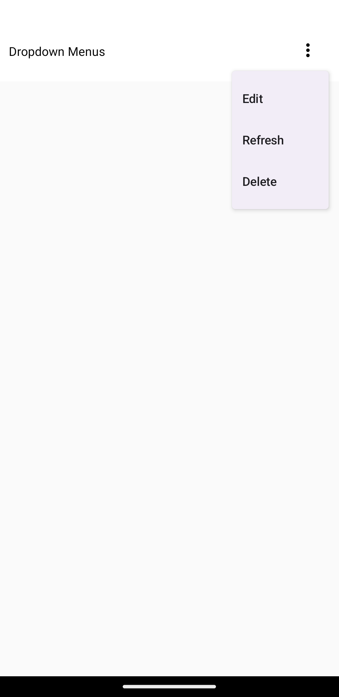
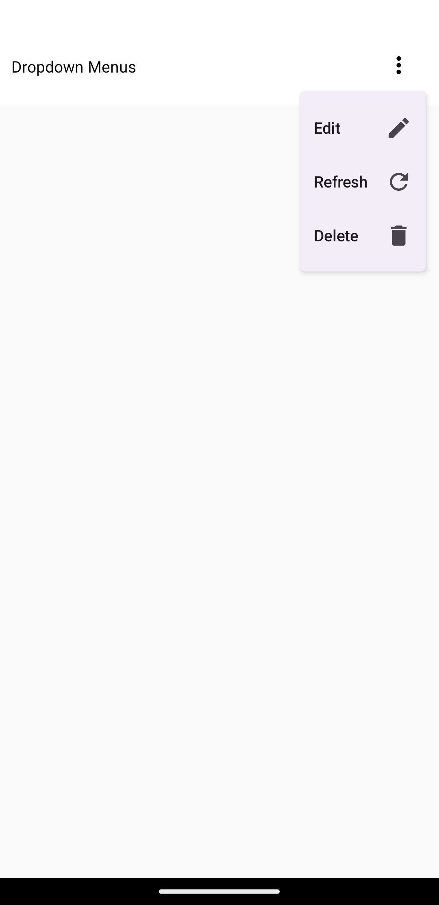
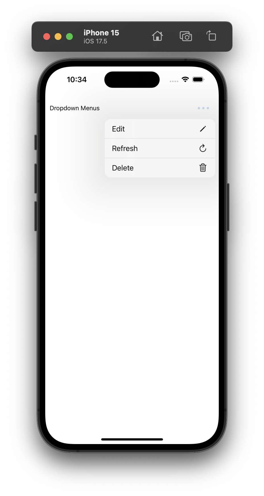

# React Native Dropdown Menu

:construction: Experiment :construction:

This project is an simple React Native library built using Expo Module Core to create a native Dropdown menu. It uses Compose on the Android side and SwiftUI on the iOS side.

## Features

- Platform based Native UI 
- Native platform specific icons support

## Usage

```tsx

import { NativeMenusView } from "native-menus";

const options = [
  {
    title: "Edit",
    icon: { android: "Edit", ios: "pencil" },
    onPress: () => console.log("Pressed Edit"),
  },
  {
    title: "Refresh",
    onPress: () => console.log("Pressed Refersh"),
    icon: { android: "Refresh", ios: "arrow.clockwise" },
  },
  { title: "Delete", onPress: () => console.log("Pressed Delete") },
];


<NativeMenusView menuItems={options} />

```
## Props

- **menuItems** (array): An array of objects representing the options in the drop-down menu. Each object can have the following properties:
  - `title` (string): The title of the menu item.
  - `onPress` (function): A callback function that gets called when the menu item is selected.
  - `icon` (object, optional): An object that specifies the icons for the menu item on different platforms.
    - `android` (AndroidIcons, optional): The icon to be used on Android devices. This should be selected from a predefined list of Material icons (Filled Icons). 
    - `ios` (SFSymbol, optional): The icon to be used on iOS devices. The icons are provided through the [sf-symbols-typescript](https://github.com/nandorojo/sf-symbols-typescript) library, which offers a comprehensive list of SF Symbols.
 


## Screenshots

### Without Icons

**Android**          



**iOS**


### With Icons

**Android**          



**iOS**




### With and Without Icons

**Android**          


**iOS**


